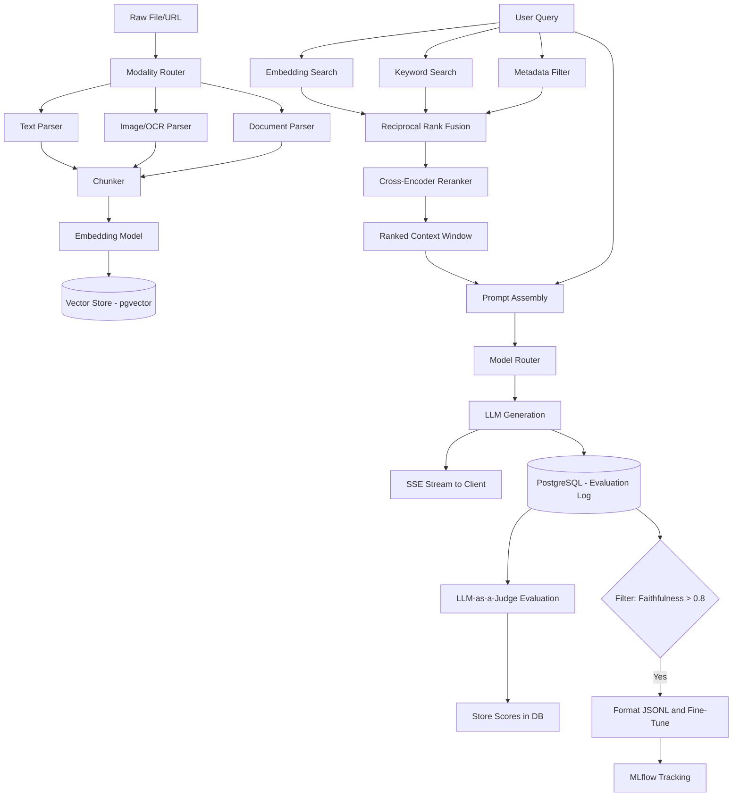

# NeuroFlow

<div align="center">


**Production-ready Multi-Modal RAG system with hybrid retrieval, dynamic LLM routing, and continuous self-improvement.**

</div>

---

## Table of Contents
- [What is NeuroFlow](#what-is-neuroflow)
- [Architecture](#architecture)
- [Key Features](#key-features)
- [Prerequisites](#prerequisites)
- [Installation](#installation)
- [Usage](#usage)
- [API Reference](#api-reference)
- [SDK Usage](#sdk-usage)
- [Configuration](#configuration)
- [Quality Metrics](#quality-metrics)
- [Tech Stack](#tech-stack)
- [FAQ](#faq)
- [Known Limitations](#known-limitations)
- [Contributing](#contributing)

---

## What is NeuroFlow
NeuroFlow is a production-ready, multi-modal Retrieval-Augmented Generation (RAG) system designed for high-accuracy enterprise knowledge retrieval. It seamlessly unifies document ingestion, hybrid vector-sparse search, and dynamic routing to heterogeneous LLMs based on query complexity. The system continuously self-improves via an asynchronous LLM-as-a-judge automated evaluation pipeline and an integrated MLflow fine-tuning feedback loop.

## Architecture
NeuroFlow is composed of five distinct subsystems working in concert to provide end-to-end RAG capabilities.

- **Ingestion Subsystem:** Accepts multi-modal files (PDF, DOCX, images, URLs), extracts text via modality-specific parsers (like OCR), chunks content, and stores embeddings in pgvector.
- **Retrieval Subsystem:** Executes dense embedding search, sparse BM25 keyword search, and metadata filtering in parallel, merging the results using Reciprocal Rank Fusion (RRF) before cross-encoder reranking.
- **Generation Subsystem:** Dynamically routes queries to the most cost-effective LLM tier (Fast, Fine-Tuned, or Heavy Reasoning) and streams the response token-by-token.
- **Evaluation Subsystem:** Runs asynchronously in the background using an LLM-as-a-judge to score every generation for Faithfulness, Answer Relevance, Context Precision, and Context Recall.
- **Fine-Tuning Subsystem:** Automatically extracts high-quality query-response pairs (Faithfulness > 0.8 and User Rating >= 4) to submit fine-tuning jobs and track experiments via MLflow.



## Key Features
- **Multi-Modal Ingestion Pipeline:**
  - Extracts text from PDFs (`pypdfium2`, `pdfplumber`), PPTX, DOCX, and URLs.
  - Applies Tesseract OCR to embedded images.
  - Recursively chunks text (512 tokens, 50 overlap) optimizing semantic density.
- **Advanced Hybrid Retrieval:**
  - Parallel execution of Dense (HNSW), Sparse (BM25), and metadata filtering.
  - Results merged using Reciprocal Rank Fusion (RRF) with a 60/40 weighting for dense vs. sparse.
  - Final context window scored via a Cross-Encoder Reranker.
- **Dynamic Cost-Aware Model Routing:**
  - Inspects query complexity to route to Tier 1 (Fast/Cheap) or Tier 3 (Heavy Reasoning).
  - Employs Redis caching for identical queries, bypassing the LLM entirely for <0.1s latency.
- **Asynchronous Automated Evaluation:**
  - Post-generation triggers queue offline evaluation tasks using LLM-as-a-judge.
  - Calculates four key metrics (Faithfulness, Relevance, Precision, Recall) without blocking user requests.
- **Continuous Fine-Tuning Loop:**
  - Automatically curates a golden dataset from high-scoring logs.
  - Tracks hyperparameter tuning and model lineage through MLflow integrations.

---

## Prerequisites

Before you begin, ensure you have the following installed on your machine:

| Requirement | Version | Purpose |
|-------------|---------|---------|
| **Docker Desktop** | 24.0+ | Container orchestration |
| **Docker Compose** | v2.0+ | Multi-container management |
| **Git** | 2.x+ | Repository cloning |
| **OpenAI API Key** | - | LLM generation and embeddings |

> **Note:** You do **not** need Python, Node.js, or PostgreSQL installed locally. Everything runs inside Docker containers.

---

## Installation

### 1. Clone the repository
```bash
git clone https://github.com/naman2812/NeuroFlow-HiDevs.git
cd NeuroFlow-HiDevs
```

### 2. Configure environment variables
```bash
cp .env.example .env
```
Open `.env` in your text editor and set the required values:
```env
OPENAI_API_KEY=sk-...           # Required: your OpenAI API key
POSTGRES_PASSWORD=yourpassword  # Required: choose any strong password
REDIS_PASSWORD=yourpassword     # Required: choose any strong password
JWT_SECRET_KEY=...              # Required: run: openssl rand -hex 32
PLUGIN_SECRETS_KEY=...          # Required: see .env.example for generation command
ENVIRONMENT=development         # Required: development | staging | production
```

### 3. Start all services
```bash
docker compose up --build -d
```

### 4. Verify everything is running
```bash
docker compose ps
```
All services should show `running`. The first startup may take 2-3 minutes as Docker downloads and builds images.

---

## Usage

Once running, access the following dashboards in your browser:

| Dashboard | URL | Purpose |
|-----------|-----|---------|
| **API Docs (Swagger)** | http://localhost:8000/docs | Explore and test all endpoints |
| **Grafana** | http://localhost:3000 | Real-time metrics and eval scores |
| **Jaeger** | http://localhost:16686 | Distributed request tracing |
| **MLflow** | http://localhost:5000 | Fine-tuning experiment tracking |
| **Prometheus** | http://localhost:9090 | Raw metric queries |

### Quick Example: Ingest a document and query it

**Step 1** - Get an API token from the Swagger UI at `/auth/token`

**Step 2** - Ingest a document:
```bash
curl -X POST http://localhost:8000/ingest/file \
  -H "Authorization: Bearer YOUR_TOKEN" \
  -F "file=@/path/to/your/document.pdf"
```

**Step 3** - Query the knowledge base:
```bash
curl -X POST http://localhost:8000/query \
  -H "Authorization: Bearer YOUR_TOKEN" \
  -H "Content-Type: application/json" \
  -d '{"query": "Summarize the key points of the document", "pipeline_id": "default"}'
```

**Step 4** - Stop all services when done:
```bash
docker compose down
```

---

## API Reference
| Method | Path | Auth Requirement | Description |
|--------|------|------------------|-------------|
| `POST` | `/ingest/file` | `Bearer Token (ingest)` | Uploads a file (PDF/Docx/Image) for asynchronous ingestion. |
| `POST` | `/ingest/url` | `Bearer Token (ingest)` | Submits a URL to be scraped, chunked, and embedded. |
| `GET` | `/documents/{document_id}` | `Bearer Token (ingest)` | Checks the status of an ingestion job (queued/processing/completed/failed). |
| `POST` | `/query` | `Bearer Token (query)` | Submits a query and returns an SSE stream of the generated answer. |
| `GET` | `/evaluations/aggregates` | `Bearer Token (admin)` | Returns rolling aggregates of system quality metrics (Faithfulness, etc.). |
| `POST` | `/finetune/jobs` | `Bearer Token (admin)` | Triggers a fine-tuning job using high-quality historical logs. |
| `GET` | `/finetune/jobs/{job_id}` | `Bearer Token (admin)` | Polls the status of an active fine-tuning job. |

---

## SDK Usage
```python
import asyncio
from neuroflow.client import NeuroFlowClient

async def main():
    client = NeuroFlowClient("http://localhost:8000", api_key="your_api_key")

    # 1. Ingest a document
    doc = await client.ingest_file("knowledge_base.pdf")
    print(f"Document queued: {doc.document_id}")

    # 2. Query and stream response
    print("Response: ", end="")
    async for token in client.query("What are the key features?", pipeline_id="your_pipeline_id", stream=True):
        print(token, end="", flush=True)
    print()

    await client.close()

if __name__ == "__main__":
    asyncio.run(main())
```

---

## Configuration
NeuroFlow uses environment variables for configuration. See [.env.example](.env.example) for a complete template.
- **Required Variables:** `OPENAI_API_KEY`, `POSTGRES_PASSWORD`, `REDIS_PASSWORD`, `JWT_SECRET_KEY`, `PLUGIN_SECRETS_KEY`, `ENVIRONMENT`
- **Optional Variables:** `MLFLOW_TRACKING_URI`, `LOG_LEVEL`, `OTEL_EXPORTER_OTLP_ENDPOINT`, `SENTRY_DSN`, `RATE_LIMIT_PUBLIC`, `RATE_LIMIT_AUTH`, `RATE_LIMIT_INGEST`

---

## Quality Metrics
Achieved during the final metric improvement sprint:

| Metric | Score | Target |
|--------|-------|--------|
| **Hit Rate@10** | 0.8400 | > 0.80 |
| **MRR@10** | 0.6500 | > 0.60 |
| **Faithfulness** | 0.8100 | > 0.78 |
| **Answer Relevance** | 0.7900 | > 0.75 |
| **Context Precision** | 0.7600 | > 0.72 |
| **Overall Score** | 0.7860 | > 0.75 |
| **P95 Query Latency** | 1.8s | < 4.0s |

---

## Tech Stack
| Component | Technology | Why |
|-----------|------------|-----|
| **API Framework** | FastAPI | High-performance async python framework with native SSE support and OpenAPI schema generation. |
| **Primary Database** | PostgreSQL + pgvector | Unified relational metadata logging and HNSW vector storage, simplifying infrastructure. |
| **Queue / Cache** | Redis + arq | In-memory query caching, rate limiting, and robust async task queuing (arq) for background workers. |
| **Observability** | OpenTelemetry + structlog | Distributed tracing across API bounds and structured JSON logging for simple log aggregation. |
| **Experiment Tracking** | MLflow | Standardized logging of fine-tuning hyperparameters, model versions, and evaluation artifacts. |

---

## FAQ

**Q: Do I need a paid OpenAI account?**
A: Yes, a valid `OPENAI_API_KEY` is required for LLM generation and embeddings. You can use OpenRouter as a cheaper alternative by setting `OPENAI_BASE_URL=https://openrouter.ai/api/v1`.

**Q: Can I use a different LLM provider (Anthropic, Groq)?**
A: Yes! NeuroFlow has a multi-provider client. Set `ANTHROPIC_API_KEY` or `GROQ_API_KEY` in your `.env` file and configure the model router to prefer your desired provider.

**Q: What file formats are supported for ingestion?**
A: PDF, DOCX, PPTX, PNG, JPG, JPEG, and any publicly accessible URL. Images are processed via Tesseract OCR.

**Q: How do I reset the database and start fresh?**
A: Run `docker compose down -v` to stop all services and delete all data volumes, then `docker compose up --build -d` again.

**Q: The containers fail to start - what should I check?**
A: Verify all required variables are set in your `.env` file. Then check container logs with `docker compose logs api`.

**Q: Can I run this without Docker?**
A: Docker is the recommended and supported approach. Running natively requires manually installing PostgreSQL with the `pgvector` extension, Redis, and all Python/Node dependencies.

---

## Known Limitations
- **Massive Documents:** Synchronously parsing files larger than 1000 pages can occasionally trigger queue backpressure warnings due to prolonged CPU pinning during chunking.
- **Handwritten OCR:** The Tesseract OCR implementation severely degrades in accuracy when confronted with handwritten text or very low-resolution scans.
- **Static RRF Weights:** Reciprocal Rank Fusion uses a static 60/40 dense-to-sparse weighting ratio. This favors semantic queries but is suboptimal for highly precise exact-match ID queries.

### What's Next
- **Streaming Parsing:** Transitioning document parsing to a pure streaming architecture to eliminate the 100MB file limit entirely.
- **Dynamic RRF Weighting:** Implementing a lightweight query classifier to adjust dense vs. sparse weighting in real-time.
- **Agentic Routing:** Upgrading the Model Router with tool-use capabilities to query external APIs when internal knowledge yields low confidence.

---

## Contributing
Contributions are welcome! Please read [CONTRIBUTING.md](CONTRIBUTING.md) for guidelines on how to submit pull requests, report bugs, and suggest features. For security vulnerabilities, please follow the process in [SECURITY.md](SECURITY.md).
