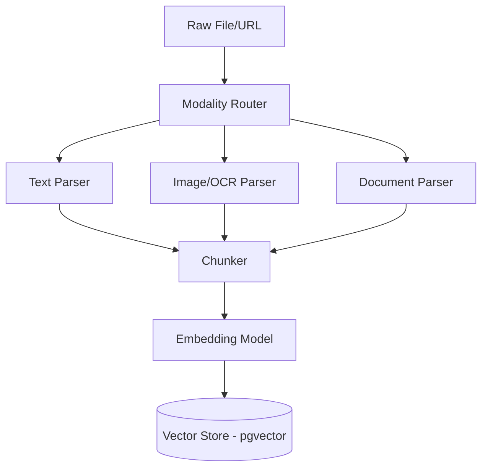
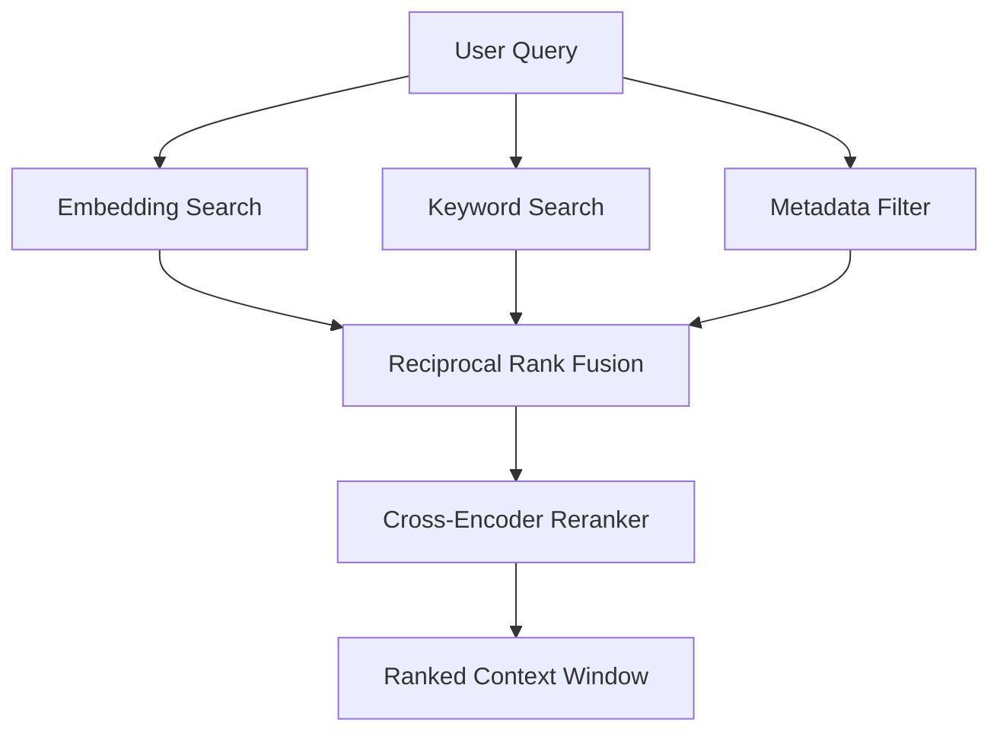
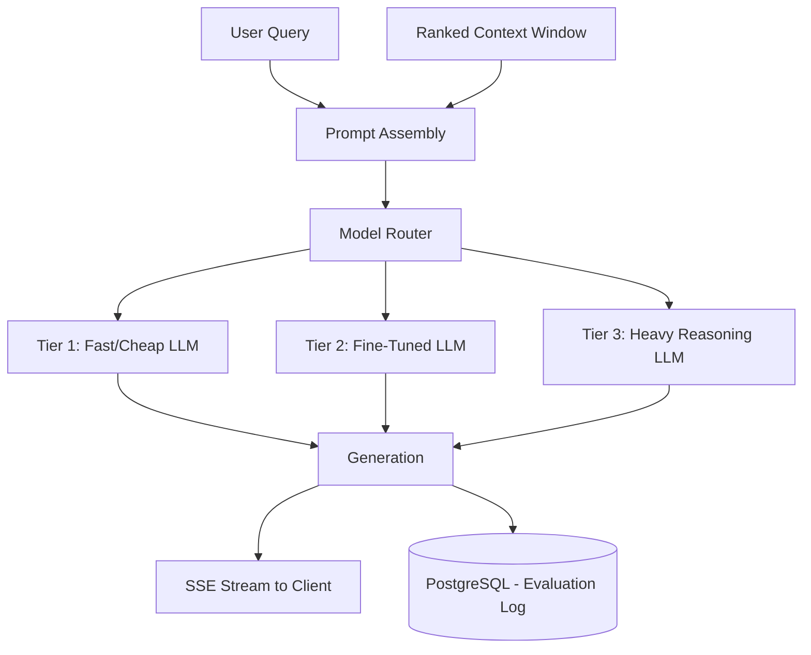
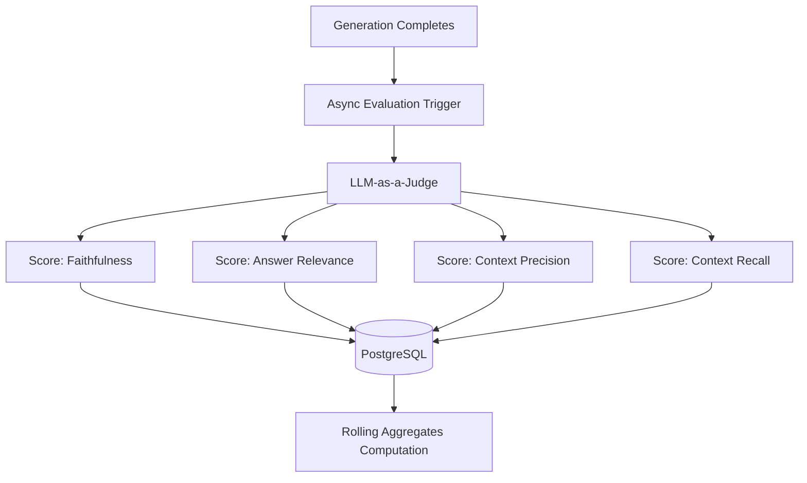
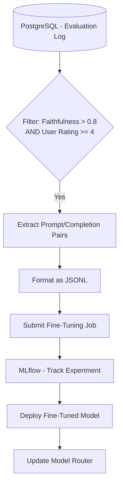

# NeuroFlow Architecture

NeuroFlow is designed with five core architectural subsystems to handle end-to-end ingestion, retrieval, generation, evaluation, and fine-tuning.

## 1. Ingestion Subsystem

The Ingestion Subsystem is responsible for accepting raw files (PDF, DOCX, images, CSV, web URLs), extracting content per modality, chunking it, embedding it, and writing to the vector store.

**Data Flow:**
1. **File Upload**: User uploads file via API.
2. **Modality Router**: Identifies file type and routes to specific parsers.
3. **Extraction**: Content is extracted (e.g., text from PDF, OCR from images).
4. **Chunking**: Extracted content is broken down using a specified chunking strategy (see ADR-002).
5. **Embedding**: Chunks are passed through an embedding model.
6. **Vector Store**: Embeddings and metadata are written to the Vector Store (pgvector, see ADR-001).

## 2. Retrieval Subsystem

The Retrieval Subsystem executes when a user query is received. It performs parallel searches and reranking to construct a highly relevant context window.

**Data Flow:**
1. **User Query**: Incoming text query.
2. **Parallel Search**:
   - Embedding Similarity Search (Dense)
   - Keyword Search (Sparse / BM25)
   - Metadata Filtering
3. **Fusion**: Results are merged using Reciprocal Rank Fusion (RRF).
4. **Reranking**: A cross-encoder reranker scores the fused results against the query.
5. **Context Window**: Top-K results are returned as the context window.

## 3. Generation Subsystem

The Generation Subsystem takes the retrieved context window and the user query to produce an answer via the appropriate LLM.

**Data Flow:**
1. **Prompt Assembly**: The context window and query are injected into a prompt template.
2. **Model Router**: Decides which LLM to use based on cost, capability, and domain (see ADR-004).
3. **Generation**: The chosen LLM generates the response.
4. **Streaming**: The response is streamed token-by-token back to the client via SSE.
5. **Logging**: The complete Input/Output pair, along with metadata, is logged to PostgreSQL for evaluation.

## 4. Evaluation Subsystem

The Evaluation Subsystem asynchronously scores every generation using an LLM-as-a-judge approach (see ADR-003).

**Data Flow:**
1. **Async Trigger**: Triggered when a generation completes.
2. **Scoring**: Computes metrics:
   - **Faithfulness**: Are claims grounded in the retrieved context?
   - **Answer Relevance**: Does it address the question?
   - **Context Precision**: Are retrieved chunks actually used?
   - **Context Recall**: Were all relevant chunks retrieved?
3. **Storage**: Stores scores in PostgreSQL.
4. **Aggregation**: Computes rolling aggregates to monitor system health over time.

## 5. Fine-Tuning Subsystem

The Fine-Tuning Subsystem continuously improves the system by training on high-quality outputs.

**Data Flow:**
1. **Extraction**: Queries the evaluation log for pairs where `faithfulness > 0.8` AND `user_rating >= 4`.
2. **Formatting**: Formats the pairs into JSONL.
3. **Job Submission**: Submits jobs to the fine-tuning service.
4. **Tracking**: Logs experiments, hyper-parameters, and metrics in MLflow.
5. **Deployment**: Updates the Model Router to direct similar queries to the fine-tuned model if it outperforms the base model.

